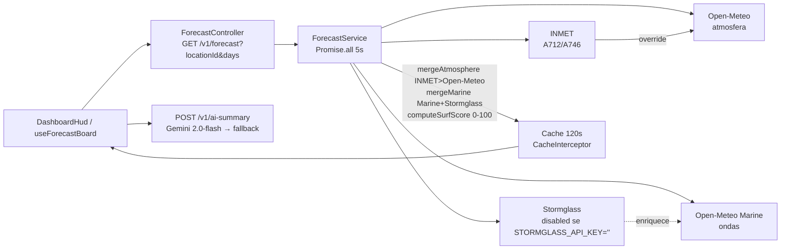

# Meteor 2.0 — Tactical Surf Telemetry HUD

> Dashboard HUD tático para surf em **Ilha Comprida e Vale do Ribeira** — substrate graphite/preto, **laranja** para vento/alerta e **dourado** para Surf Score/swell, radius 0–2px, sem roxo, sem azul genérico. Fonte da verdade: [`DESIGN.md`](./DESIGN.md) → [`apps/frontend/src/app/globals.css`](./apps/frontend/src/app/globals.css) `@theme`.


## Especificações do Sistema (até Fase 5 — `ecfbbfb`)

### Stack & Versões

| Camada | Tech | Versão | Uso |
|---|---|---|---|
| **Monorepo** | `pnpm` | `11` | `pnpm-workspace.yaml` `packages: ["apps/*"]`, scripts `dev`/`lint`/`test`/`build` `package.json:5` |
| **Backend** | `NestJS` + `Express` | `11.1.5` | `apps/backend/src/main.ts` `enableCors(FRONTEND_ORIGIN)` + helmet fallback + `app.module.ts` `ConfigModule` + `ThrottlerModule 30/min` |
| **Cache** | `@nestjs/cache-manager` + `cache-manager` | `3.0.1 / 6.4.3` | `forecast.module.ts` `ttl: 120 * 1000` ms (120s) + `@CacheTTL(120*1000)` `forecast.controller.ts:18` |
| **AI** | `@google/genai` | `1.12.0` | `gemini.repository.ts` `gemini-2.0-flash` PT-BR 2 frases, fallback sem `GEMINI_API_KEY` |
| **Validação** | `zod` | `3.25.76` | `env.schema.ts`, `forecast-query.dto.ts`, `zod-validation.pipe.ts` |
| **Frontend** | `Next.js` App Router | `15.4.6` | `src/app/layout.tsx` `pt-BR`, `loading.tsx`/`error.tsx` |
| **UI** | `React` + `Tailwind v4` + `Motion` | `19.1.1 / 4.1.11 / 12.23` | `@theme` `globals.css`, `SurfScore`/`WaveChart` spring, `oxlint` |
| **Testes** | `Jest` (backend) + `Vitest` (frontend) | `29.7 / 3.2` | `jest.config.cjs` + `vitest.config.ts`, 8 specs Fase 2 |
| **Qualidade** | `ESLint` + `Prettier` + `commitlint` | `9.39 / 3.6 / 19.8` | `eslint.config.mjs`, `commitlint.config.cjs` |
| **MCP** | `@octokit/rest` | `21.1` | `.opencode/mcp/github-server.mjs` `process.env.GITHUB_TOKEN` |

### Arquitetura



- **Camadas obrigatórias:** `Controller → Service → Repository` `forecast.service.ts:35` — `Controller` só HTTP, `Service` regras, `Repository` I/O.
- **Envelope:** `{success, data, error:{code,message,details}}` `common/http/api-envelope.ts` + `envelope.interceptor.ts` + `http-exception.filter.ts` + `zod-validation.pipe.ts:4` `VALIDATION_ERROR` 400.
- **Segurança:** `helmet` (fallback manual `X-Content-Type-Options` etc `main.ts:11`) + `ThrottlerModule 60_000/30` `app.module.ts:11` + `enableCors({origin: FRONTEND_ORIGIN})`.

### Estrutura do Projeto

```
Meteor_2.0/
├── pnpm-workspace.yaml          # packages: ["apps/*"]
├── DESIGN.md                    # tokens graphite/preto + laranja/dourado, radius 0-2px
├── docs/
│   ├── api.md                   # curl + envelope
│   └── plans/
│       ├── meteor-hud-mvp.md    # Fases 0-5 (super-maker)
│       └── backlog.md           # P0/P1/P2
├── apps/backend/src/
│   ├── main.ts                  # bootstrap, CORS, helmet, PORT
│   ├── app.module.ts            # ConfigModule + ThrottlerModule + ForecastModule + AiSummaryModule
│   ├── health.controller.ts     # GET /health
│   ├── common/config/env.schema.ts
│   ├── common/http/             # api-envelope, envelope.interceptor, http-exception.filter, zod-validation.pipe
│   └── modules/
│       ├── forecast/
│       │   ├── catalog/locations.ts      # 6 locações
│       │   ├── dto/forecast-query.dto.ts # Zod locationId, days 1-7
│       │   ├── providers/forecast-provider.types.ts
│       │   └── repositories/
│       │       ├── open-meteo.repository.ts
│       │       ├── open-meteo-marine.repository.ts
│       │       ├── stormglass.repository.ts  # disabled sem chave, days*24
│       │       └── inmet.repository.ts       # YYYY-MM-DD, 5s timeout
│       └── ai-summary/
│           ├── gemini.repository.ts
│           └── dto/ai-summary-body.dto.ts
└── apps/frontend/src/
    ├── app/
    │   ├── layout.tsx           # pt-BR, Archivo Black + JetBrains Mono, metadataBase + viewport dark
    │   ├── globals.css          # @import tailwindcss; @theme tokens
    │   ├── page.tsx             # <DashboardHud />
    │   ├── loading.tsx          # skeleton aria-busy
    │   └── error.tsx            # Link Down + Retry
    ├── components/
    │   ├── atoms/      Frame, MetricValue, SelectorChip, StatusDot, SurfScore (gold 72px)
    │   ├── molecules/  CitySelector, DaySelector, SourceStrip, WindSwellMeters (6 métricas)
    │   ├── organisms/  HudHeader, TelemetryGrid (aria-live), WaveChart (aria, empty "no data")
    │   └── templates/  DashboardHud
    ├── hooks/useForecastBoard.ts # AbortController, error LINK DOWN, locations→forecast→summary
    └── lib/
        ├── api.ts                # baseUrl NEXT_PUBLIC_API_URL, unwrapEnvelope success:false, timeout 5s
        └── schemas.ts            # Zod location/forecast/envelope
```

### Design Tokens

| Token | Valor | Uso |
|---|---|---|
| `bg` | `#0A0A0A` | fundo |
| `graphite` | `#141414` | cards Surf Score |
| `surface` | `#1C1C1C` | HudHeader |
| `line` | `#2A2A2A` | bordas 1px |
| `ink` | `#E8E4DC` | texto |
| `muted` | `#8A8478` | labels mono 10px |
| `orange` | `#FF6A1A` | vento/dir/alerta |
| `gold` | `#E0B429` | Surf Score/swell/period/wave |
| `hazard` | `#FF3B1A` | erro |
| `radius` | `0px` default, `2px` hair | sem sombra, flat planes |

Tipografia: `Archivo Black 42px 900` títulos uppercase + `JetBrains Mono 12px 500` telemetria `layout.tsx:5`. Ver [`DESIGN.md`](./DESIGN.md).

### Pipeline de Forecast

| Fonte | Provider ID | Chave | Dados |
|---|---|---|---|
| **Open-Meteo** | `open-meteo` | não | `temperature_2m, wind_speed_10m, wind_direction_10m, precipitation` + hourly `forecast_days=days` `open-meteo.repository.ts:23` |
| **Open-Meteo Marine** | `open-meteo-marine` | não | `wave_height, wave_period, wave_direction, swell_wave_height` + hourly `marine:22` |
| **Stormglass** | `stormglass` | `STORMGLASS_API_KEY` opcional → `disabled` se vazia `stormglass.repository.ts:25` | `waveHeight, swellHeight` `hours.slice(0, days*24)` `stormglass.repository.ts:54` |
| **INMET** | `inmet` | `INMET_API_TOKEN` opcional, `INMET_BASE_URL` default | `TEM_INS→temperatureC, UMD_INS→humidityPct, VEN_VEL→windSpeedMs` `inmet.repository.ts:21` `estacao/YYYY-MM-DD/YYYY-MM-DD/A712|A746` 5s timeout |

**Orquestração `forecast.service.ts:35`:**
- `Promise.all [openMeteo.fetchAtmosphere(days), marine.fetchMarine(days), stormglass.fetchMarine(days), inmet.fetchStation]` 5s `AbortSignal.timeout`.
- Se `atmosphereRes.error && marineRes.error` → `502 FORECAST_UNAVAILABLE`.
- `mergeAtmosphere:74` — `INMET.temperatureC/windSpeedMs` override `Open-Meteo` quando `status ok`.
- `mergeMarine:99` — `marine.waveHeightM ?? stormglass` + `swellHeightM: stormglass ?? marine` + `hourly: marine.hourly.length>0 ? marine : stormglass.hourly`.
- `computeSurfScore:121` — `swell*18 cap40 + period*2.5 cap35 - wind*2 cap30 +20` clamped `0-100`.
- Cache `CacheModule ttl 120*1000` + `@CacheTTL(120*1000)` 120s.

### Catálogo de Locações

| ID | Nome | Região | Lat/Lon | INMET |
|---|---|---|---|---|
| `ilha-comprida` | Ilha Comprida | `ilha-comprida` | `-24.7389, -47.5556` | `A712` |
| `iguape` | Iguape | `ilha-comprida` | `-24.7081, -47.5553` | `A712` |
| `cananeia` | Cananeia | `vale-do-ribeira` | `-25.0147, -47.9267` | `A746` |
| `registro` | Registro | `vale-do-ribeira` | `-24.4879, -47.8437` | `A746` |
| `jacupiranga` | Jacupiranga | `vale-do-ribeira` | `-24.6925, -48.0536` | `A746` |
| `cajati` | Cajati | `vale-do-ribeira` | `-24.7361, -48.1228` | `A746` |

`catalog/locations.ts:10`.

### API

Ver [`docs/api.md`](./docs/api.md) completo. Resumo:

| Método | Rota | OK | Erro |
|---|---|---|---|
| `GET` | `/health` | `200 {status:"ok", service:"meteor-backend"}` | — |
| `GET` | `/v1/locations` | `200 Zod array Location` | — |
| `GET` | `/v1/forecast?locationId=&days=1-7` | `200 {location, surfScore, atmosphere, marine, sources[]}` cache 120s | `404 LOCATION_NOT_FOUND`, `400 VALIDATION_ERROR`, `502 FORECAST_UNAVAILABLE` |
| `POST` | `/v1/ai-summary` `{locationName, surfScore, windSpeedMs, waveHeightM, swellHeightM, wavePeriodS}` | `200 {summary:"Resumo tático em 2 frases PT-BR..."}` `gemini-2.0-flash` | `400 VALIDATION_ERROR`, `429` throttler 30/min |

Envelope:
```ts
{success: true, data: T, error: null}
// ou
{success: false, data: null, error: {code, message, details?}}
```

Frontend `lib/api.ts:16` `unwrapEnvelope` trata `success:false` → `throw error.message`, `AbortSignal.timeout(5000)`.

### Frontend HUD

- **HUD:** `DashboardHud` → `HudHeader` (`Meteor` `Archivo Black` + `CitySelector` 6 + `DaySelector` D0-D+2) + `TelemetryGrid` `lg:grid-cols-12` (`SurfScore` gold `lg:col-span-4`, `WindSwellMeters` `lg:col-span-8`, `WaveChart` `lg:col-span-12`, `Gemini brief` `lg:col-span-12`, `SourceStrip` `lg:col-span-12`) `TelemetryGrid.tsx:14`.
- **Métricas `WindSwellMeters`:** Wind `m/s` orange, Dir `°` orange, Swell `m` gold, Period `s` gold, Wave `m` gold, Temp `°C` ink.
- **WaveChart `WaveChart.tsx:11`:** `points.slice(dayIndex*24, dayIndex*24+24)` fallback `0,24`, `max 0.1`, `320×88` SVG `motion.path` gold `pathLength` spring `80/18`, `empty → "M0 44 L320 44" + "no data"`, `aria-label`.
- **Hook `useForecastBoard.ts:1`:** `locations`/`locationId="ilha-comprida"`/`dayIndex`/`forecast`/`summary`/`error`/`loading`, `fetchLocations` mount + `load(locationId)` `fetchForecast→fetchAiSummary` sequential com `AbortController` + `LINK DOWN — ${message}`.
- **Design:** `globals.css` `@theme --color-bg ... --radius-hair 2px`, `layout.tsx` `pt-BR`, `loading.tsx` skeleton `aria-busy`, `error.tsx` `Link Down` + `Retry`.

## Quick Start / Reprodução

### Prerequisites

- `Node >=22`
- `pnpm 11` (`corepack enable` → `corepack prepare pnpm@11 --activate`)
- `Python 3` para `checklist.py`/`verify_all.py` (opcional)

### Configuration

| Variable | Description | Default | Required |
|---|---|---|---|
| `PORT` | Backend port | `3001` | não |
| `FRONTEND_ORIGIN` | CORS origin | `http://localhost:3000` | não |
| `NODE_ENV` | `development\|test\|production` | `development` | não |
| `GEMINI_API_KEY` | AI summary `gemini-2.0-flash` — fallback determinístico se vazia `gemini.repository.ts:40` | `""` | **sim** p/ AI real |
| `STORMGLASS_API_KEY` | Marine premium — `disabled` se vazia `stormglass.repository.ts:25` | `""` | não |
| `INMET_API_TOKEN` | Observações INMET — envia `Bearer` `inmet.repository.ts:28` se presente | `""` | não |
| `INMET_BASE_URL` | Base INMET | `https://apitempo.inmet.gov.br` | não |
| `GITHUB_TOKEN` | `.opencode/mcp/github-server.mjs` Octokit | `""` | não |
| `GITHUB_OWNER` | GitHub owner | `Carlosaleee` | não |
| `GITHUB_REPO` | GitHub repo | `Meteor2.0` | não |
| `NEXT_PUBLIC_API_URL` | URL pública do backend — **nunca segredo** | `http://localhost:3001` | não |

Ver `.env.example:1` + `env.schema.ts:3` `parseEnv` Zod.

### Installation

```bash
cp .env.example .env
# edite .env — preencha GEMINI_API_KEY se quiser AI real
pnpm install
```

### Development

```bash
pnpm dev
# → backend  http://localhost:3001  GET /health, GET /v1/locations, GET /v1/forecast?locationId=ilha-comprida
# → frontend http://localhost:3000  HUD cockpit

# health check
curl http://localhost:3001/health
curl "http://localhost:3001/v1/forecast?locationId=ilha-comprida&days=3"
```

### Build & Verify

```bash
pnpm --filter backend lint && pnpm --filter frontend lint
pnpm --filter backend test   # 8 specs Fase 2 (forecast.service, controller, 4 repos, envelope, ai-summary)
pnpm --filter frontend test  # vitest: schemas.test, SurfScore.test, useForecastBoard.test, api.test
pnpm --filter backend build && pnpm --filter frontend build

# Fable
PYTHONIOENCODING=utf-8 python .agents/scripts/checklist.py .        # Security→Lint→Schema→Tests→UX→SEO (Security PASSED Fase 5)
PYTHONIOENCODING=utf-8 python .agents/scripts/verify_all.py . --url http://localhost:3001  # + Lighthouse + Playwright
```

## Verificação (Fases 0-5)

| Fase | Feito | Verify |
|---|---|---|
| **0** | Monorepo `pnpm-workspace.yaml` + `git init` `main` | `git ls-remote` `ecfbbfb`, `git ls-files` sem `.env`, com `docs/plans/meteor-hud-mvp.md` |
| **1** | Hardening INMET `today` sem `replaceAll`, TTL `120*1000` explícito, `stormglass days*24`, `AbortSignal 5000` 4 repos, `api.ts` `unwrapEnvelope` + `useForecastBoard` `AbortController` | `pnpm --filter backend test` `forecast.service.spec` verde (INMET override) |
| **2** | Pirâmide 8 specs 455 linhas | `forecast.controller.spec` + `open-meteo/marine/stormglass/inmet` specs + `api.test` envelope + `useForecastBoard.test` city switch |
| **3** | `loading.tsx` `error.tsx`, `WaveChart` `empty`/`aria`, `TelemetryGrid` `aria-live`, `layout` `openGraph/viewport` | `next build` verde, sem roxo `grep -r "#.*purple"` |
| **4** | `docs/api.md` + `README.md` + `backlog.md` | `cat docs/api.md` curl reproduz |
| **5** | `helmet` `main.ts:11` + `Throttler 30/min` `app.module.ts:11` + `Img/CapaMeteor.jpg` | `checklist.py` `Security PASSED` |

Ver `docs/plans/meteor-hud-mvp.md` Steps 0-3 + `docs/plans/backlog.md` P0 DB/Auth/7d, P1 Map/PWA/Rate limit, P2 Deploy/SEO.

## Super Agents — Fable Fusion 2026.8.28

> `.agents` (20 agents, 48 skills, 14 workflows) × `D:\Agents\.AgentsFable\AGENTS_fable.md` (130 linhas) → **25 agents (5 Super)**. Preferir Supers para task não-trivial.

| Super | Fusão | Quando usar |
|---|---|---|
| `super-orchestrator` | `orchestrator+planner` × Fable+DOE | `≥2` domínios, evidência paralela |
| `super-fullstack` | `frontend+backend+DB` × Fable | feature E2E `forecast→HUD` |
| `super-guardian` | `security+pentest+archaeologist` × Fable | audit OWASP, pre-push |
| `super-verifier` | `test+QA+debug+perf` × Fable | `prove it runs`, TDD, `TWINS:` |
| `super-maker` | `product+planner+docs` × Fable | ideia→plano `docs/plans/<slug>.md` |

`fable-method` `SKILL.md` 130 linhas + `references/failure-modes.md` + `references/examples.md` + `references/domains/` 8 adapters lazy. Routing: trivial (1 arquivo <10 linhas) → specialist, não-trivial → Super.

## Git

```bash
git clone https://github.com/Carlosaleee/Meteor2.0.git
cd Meteor2.0
cp .env.example .env
pnpm install
pnpm dev
```

`.env` `gitignored` `.gitignore:2`, `.agents/` local, `.opencode/mcp/github-server.mjs` `process.env.GITHUB_TOKEN` nunca no arquivo.

## Licença

MIT © 2026 Carlosaleee — ver [LICENSE](./LICENSE).

## Roadmap

- **Feito Fases 0-5** `docs/plans/meteor-hud-mvp.md`
- **P0** DB history + Auth settings + 7d UI `backlog.md`
- **P1** Map + PWA + Rate limit (throttler já em `app.module.ts:11`)
- **P2** Deploy Docker/CI + SEO `sitemap.ts`/`robots.ts`
